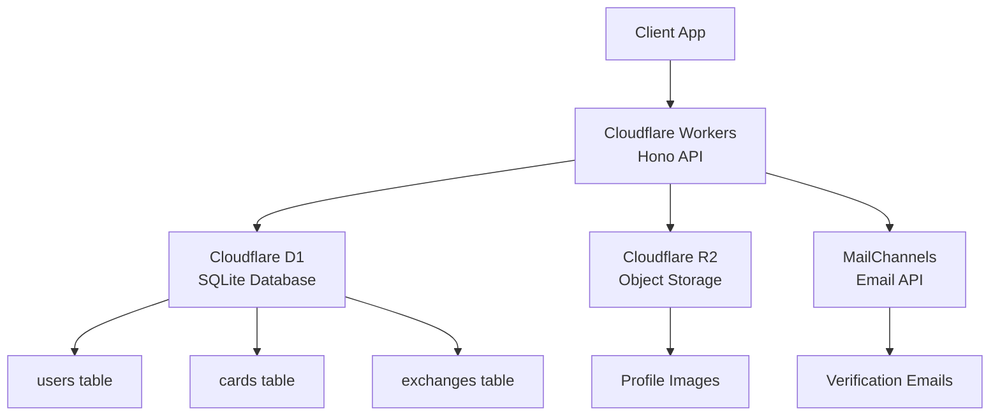

# Flocka API - 概要ドキュメント

---

## 🏗️ システムアーキテクチャ

### クラウドインフラ（Cloudflare スタック）



### 技術スタック

| カテゴリ | 技術 | 用途 |
|----------|------|------|
| **ランタイム** | Cloudflare Workers | エッジコンピューティング |
| **フレームワーク** | Hono (TypeScript) | 軽量WebAPI |
| **データベース** | Cloudflare D1 (SQLite) | メインデータストレージ |
| **ファイルストレージ** | Cloudflare R2 | 画像ファイル保存 |
| **認証** | JWT + bcrypt | セキュアな認証 |
| **メール** | MailChannels Email API | 認証メール送信 |
| **バリデーション** | Zod | スキーマ検証 |

---

## 📊 データ設計

### データベーススキーマ

```sql
-- ユーザー管理
users {
  id: TEXT (PK)
  email: TEXT (UNIQUE)
  name: TEXT
  hashed_password: TEXT
  email_verified: INTEGER
  created_at: DATETIME
}

-- プロフィールカード
cards {
  id: TEXT (PK)
  user_id: TEXT (FK → users.id)
  card_name: TEXT
  image_key: TEXT           # R2ストレージキー
  links: TEXT              # JSON形式のリンク情報
  created_at: DATETIME
}

-- カード交換記録
exchanges {
  id: TEXT (PK)
  owner_user_id: TEXT (FK → users.id)
  collected_card_id: TEXT (FK → cards.id)
  memo: TEXT               # 個人メモ
  location_name: TEXT      # 場所名
  latitude: REAL           # 緯度
  longitude: REAL          # 経度
  created_at: DATETIME
}
```

### エンティティ関係

- **1ユーザー** : **多カード** (1:N)
- **1ユーザー** : **多交換記録** (1:N) 
- **1カード** : **多交換記録** (1:N)

---

## 🔌 API エンドポイント設計

### 基本情報

- **ベースURL**: `https://api.flocka.net/`
- **認証方式**: Bearer Token (JWT)
- **レスポンス形式**: JSON

### エンドポイント一覧

#### 🔐 認証・ユーザー管理

| Method | Endpoint | 認証 | 説明 |
|--------|----------|------|------|
| `POST` | `/auth/register` | ❌ | 新規ユーザー登録 |
| `POST` | `/auth/login` | ❌ | ログイン |
| `POST` | `/auth/verify-email` | ❌ | メール認証 |
| `GET` | `/users/me` | ✅ | 現在のユーザー情報 |
| `DELETE` | `/users/me` | ✅ | アカウント削除 |

#### 🎨 カード管理

| Method | Endpoint | 認証 | 説明 |
|--------|----------|------|------|
| `POST` | `/cards/upload-url` | ✅ | 画像アップロード用URL取得 |
| `POST` | `/cards` | ✅ | 新規カード作成 |
| `GET` | `/cards` | ✅ | 自分のカード一覧 |
| `PUT` | `/cards/:id` | ✅ | カード情報更新 |
| `DELETE` | `/cards/:id` | ✅ | カード削除 |

#### 🔄 カード交換・コレクション

| Method | Endpoint | 認証 | 説明 |
|--------|----------|------|------|
| `POST` | `/exchanges` | ✅ | カード交換（位置・メモ付き） |
| `GET` | `/exchanges` | ✅ | コレクション一覧 |
| `GET` | `/exchanges/:id` | ✅ | 交換記録詳細 |
| `PUT` | `/exchanges/:id` | ✅ | メモ・位置情報更新 |
| `DELETE` | `/exchanges/:id` | ✅ | コレクションから削除 |

### リクエスト・レスポンス例

#### カード交換 `POST /exchanges`

**リクエスト:**
```json
{
  "cardId": "abc123def456",
  "memo": "コミケで交換しました！",
  "locationName": "東京ビッグサイト",
  "latitude": 35.629971,
  "longitude": 139.793625
}
```

**レスポンス:**
```json
{
  "success": true,
  "data": {
    "id": "exchange789xyz",
    "card": {
      "id": "abc123def456",
      "cardName": "デザイナー太郎",
      "imageUrl": "https://..."
    },
    "memo": "コミケで交換しました！",
    "locationName": "東京ビッグサイト",
    "latitude": 35.629971,
    "longitude": 139.793625,
    "createdAt": "2025-08-25T10:30:00Z"
  }
}
```

---

## 🔒 セキュリティ機能

### 認証・認可

- **パスワードハッシュ化**: bcrypt (saltRounds: 12)
- **JWT認証**: 
  - 有効期限: 7日間
  - 秘密鍵: 環境変数で管理
  - Bearer token形式
- **メール認証**: 
  - 24時間有効な認証トークン
  - MailChannels Email API経由で送信

### 入力検証

- **Zodスキーマ**: 全エンドポイントで厳密な型検証
- **SQLインジェクション対策**: パラメータ化クエリ
- **XSS対策**: 入力サニタイゼーション

### アクセス制御

- **CORS設定**: フロントエンド専用の適切なCORS
- **認証必須エンドポイント**: JWT検証ミドルウェア
- **所有権検証**: ユーザーは自分のデータのみアクセス可能

---

## ⚡ パフォーマンス・制限

### パフォーマンス特性

- **レスポンス時間**: 50-200ms (エッジランタイム)
- **同時接続**: Cloudflare Workersの自動スケーリング
- **データベース**: SQLiteベースの高速クエリ
- **ファイルアクセス**: R2の高速オブジェクトストレージ

### 利用制限

| 項目 | 制限値 | 説明 |
|------|-------|------|
| **画像ファイルサイズ** | 10MB | プロフィール画像の最大サイズ |
| **API リクエストレート** | 1000/分 | IP単位の制限 |
| **データベース** | D1標準制限 | 読み取り・書き込み操作 |
| **ストレージ** | R2標準制限 | ファイル保存・配信 |

---

## 🚀 デプロイ・運用

### 現在の運用状況

- **デプロイURL**: `https://api.flocka.net/`
- **バージョン**: `v1.0.0`
- **ステータス**: 🟢 運用中
- **デプロイ日**: 2025年8月25日

### 環境変数

| 変数名 | 必須 | 説明 |
|--------|------|------|
| `JWT_SECRET` | ✅ | JWT署名用秘密鍵 |
| `MAILCHANNELS_API_KEY` | ✅ | MailChannels API認証キー |
| `ENVIRONMENT` | ❌ | 実行環境識別子 |

### モニタリング

- **ヘルスチェック**: `GET /` エンドポイント
- **メトリクス**: Cloudflare Workersダッシュボード
- **ログ**: Hono内蔵ロギングミドルウェア
- **エラートラッキング**: 構造化エラーレスポンス

---

## 🔄 開発・デプロイフロー

### ローカル開発

```bash
# セットアップ
npm install
npm run db:generate

# 開発サーバー起動
npm run dev
# → http://localhost:8787
```

### デプロイ

```bash
# 本番デプロイ
npm run deploy

# ドライラン（テスト）
npm run build
```

### プロジェクト構造

```
FlockaAPI/
├── src/
│   ├── index.ts              # エントリーポイント
│   ├── types/index.ts        # TypeScript型定義
│   ├── utils/
│   │   ├── auth.ts           # JWT・パスワード処理
│   │   └── email.ts          # メール送信
│   ├── middleware/auth.ts    # 認証・CORS・エラー処理
│   └── routes/
│       ├── auth.ts           # 認証エンドポイント
│       ├── cards.ts          # カード管理
│       └── exchanges.ts      # 交換管理
├── db/schema.sql             # データベーススキーマ
├── wrangler.toml             # Cloudflare設定
└── package.json              # Node.js設定
```

*📄 ドキュメント作成日: 2025年8月25日*  
*🔄 最終更新: v1.0.0 リリース時*
